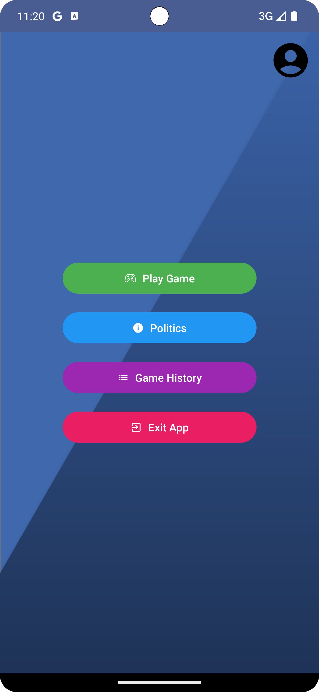
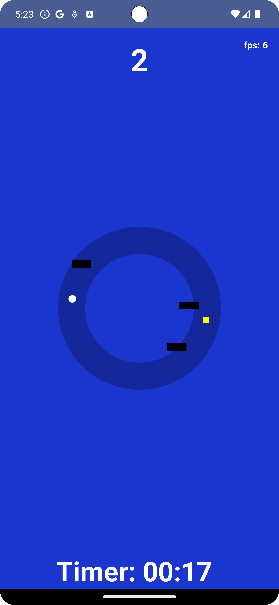
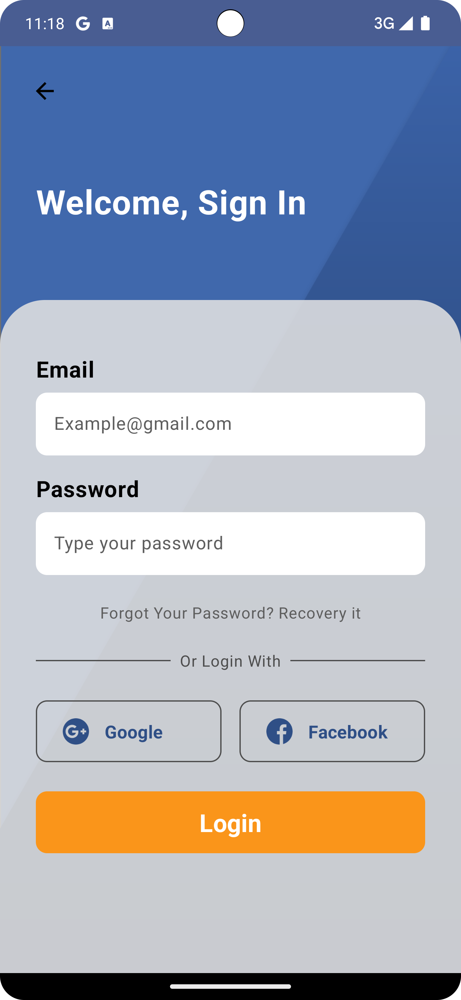
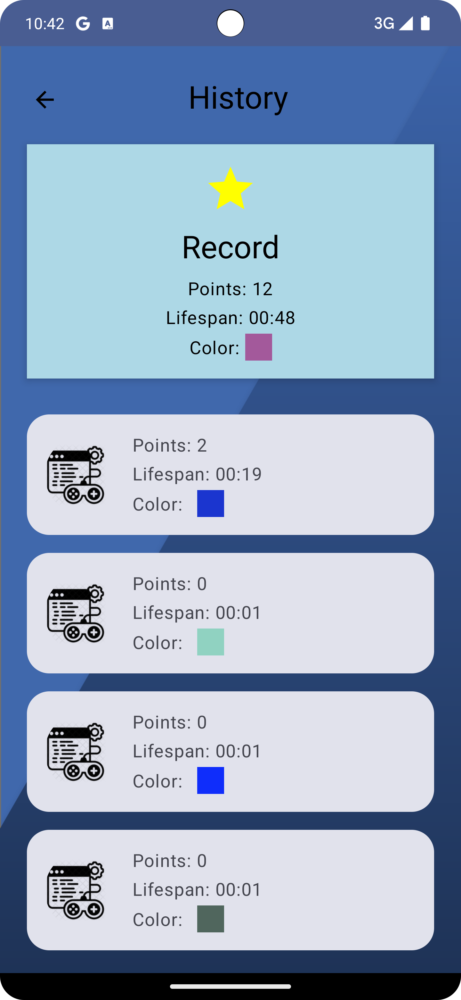

<div align="center"> <h1 > </h1></div>
<div align="center"> <h1> SpinSphere Game </h1> </div>

### 🎮 Welcome to SpinSphere Game! 

#### SpinSphere Game is an engaging Android game that challenges your reflexes and coordination. Dodge obstacles, collect points, and aim for the high score.

#### In this README, you'll find detailed information about the game, its features, and how to get started.

<hr>

## Content
- [🚀 Technologies Used](#technologies-used)
- [📸 Screenshots](#screenshots)
- [🎮 Features](#features)
- [🛠 Installation](#installation)
- [🕹️ Gameplay](#gameplay)
- [🏆 Conclusion](#conclusion)

<hr>
<div id="technologies-used" align="center">
  <h2>🚀 Technologies Used</h2>
</div>

- **Kotlin:** The primary programming language for developing the game logic and functionality.
- **Firebase Authentication:** Firebase is employed for user authentication, supporting Google, Facebook, and email/password login.
- **Retrofit:** Retrofit is used for making network requests and handling API responses.
- **Room Database:** Room is utilized for local storage and managing game history.
<hr>

- **Coroutines:** Kotlin Coroutines are used for handling asynchronous tasks.
- **ViewModel:** ViewModel architecture component is used for managing game-related data.
- **FrameClock:** Implements a FrameClock to track and display real-time Frames Per Second (FPS) information, providing insights into game performance.
- **MediaPlayer:** Incorporates the Android MediaPlayer class to manage background music, enhancing the overall gaming atmosphere.
<hr>

- **Jetpack Compose:** The game is built using Jetpack Compose for modern Android UI development.
- **WebView:** Utilizes the Android WebView component to seamlessly integrate web content, allowing features like displaying external web pages within the app.
- **Material3 Components:** Integrates Material3 components, such as Buttons and Icons.
- **Custom Composable Components:** Utilizes custom Composable components in Jetpack Compose for building a flexible and reusable UI.

<hr>
<div id="screenshots" align="center">
  <h2>📸 Screenshots</h2>
</div>

<div align="center">
  
  
  
  
</div>

<hr>
<div id="features" align="center">
  <h2 >🎮 Features</h2>
</div>

### 1. Start Game:

- Tap the "Start Game" button to begin the SpinSphere Game adventure.
- Engaging gameplay that tests your reflexes and coordination.

### 2. Score and Timer:

- Track your score and elapsed time during gameplay.
- Aim for a high score and challenge yourself to beat your best time.

### 3. Game Over Screen:

- Receive a game over screen with details on your performance.
- Options to return to the main menu or try the game again.

### 4. Game History:

- View your game history, including points, character lifespan, and background color.
- Track your best records and achievements.

### 5. FPS Display:

- Get real-time insights into game performance with the on-screen Frames Per Second (FPS) display.
- Technical feedback for enthusiasts who appreciate monitoring gaming metrics.

### 6. Authentication Options:

- Streamlined authentication process with options for Facebook, Google, email, and password.
- Flexibility for users to choose their preferred authentication method for seamless access.

### 7. Background Music:

- Immerse players in the gaming atmosphere with captivating background music.
- Carefully selected soundtrack enhances the overall gaming experience.

<hr>
<div id="installation" align="center">
  <h2 >🛠 Installation Steps</h2>
</div>

1. **Clone the Repository:**
   ```shell
       git clone https://github.com/Den-moroz/SpinSphere-Game.git
       cd SpinSphereGame
2. **Open in Android Studio:**

   - Launch Android Studio. 
   - Click on "Open an existing Android Studio project."
   - Navigate to the cloned repository and select the project.
   
3. **Run the Game:**

   - Choose an emulator or connect your Android device to the computer.
   - Click on the "Run" button in Android Studio to install and launch the game.
   
*Note:*

   Ensure you have the necessary dependencies and configurations set up in Android Studio.

<hr>
<div id="gameplay" align="center">
  <h2 >🕹️ Gameplay</h2>
</div>

SpinSphere Game offers a captivating and challenging experience with its unique gameplay mechanics. A white ball gracefully rotates around a central gray circle, creating a visually engaging and dynamic environment. Players have control over the ball's movement direction. A simple tap on the screen changes the rotation direction of the white ball, adding an interactive element to the game.

The primary objective is to navigate the rotating ball through the game space. Dark blocks swiftly fly from the left to the right side of the screen, posing a threat to the ball's trajectory. As players skillfully guide the white ball through the oncoming challenges, they have the opportunity to collect yellow squares. Each collected square contributes to the player's score, adding an element of strategy and reward to the gameplay.

<hr>
<div id="conclusion" align="center">
<h2 >🏆 Conclusion</h2>
</div>

Thank you for playing SpinSphere Game!

I hope you enjoy the thrilling gameplay and challenge yourself to beat your own records. If you have any feedback or suggestions, feel free to reach out.

<div align="center">
  <h2>Happy Gaming! 👾</h2>
</div>
<hr>
